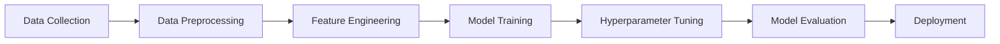

# Heart-Disease-Prediction
🫀 AI-powered heart disease prediction system achieving 82% accuracy. Built with scikit-learn &amp; Python, featuring 10-fold cross-validation, smart feature engineering, and interactive visualizations 📊. Deployment-ready ML model helping identify cardiac risk factors early. Save lives with data! 💙
<div align="center">

# 🫀 Heart Disease Prediction System

### *AI-Powered Cardiac Risk Assessment*

[](https://www.python.org/)
[](https://scikit-learn.org/)
[](https://pandas.pydata.org/)
[](https://numpy.org/)
[](https://matplotlib.org/)


**An intelligent machine learning solution for early detection of heart disease risk**

[📋 Overview](#-overview) • [✨ Features](#-features) • [🚀 Getting Started](#-getting-started) • [📊 Results](#-results) • [🤝 Contributing](#-contributing)


</div>

## 📋 Overview

Heart disease remains the **leading cause of death globally**, accounting for approximately 17.9 million deaths annually. This project leverages the power of **Machine Learning** to predict the likelihood of heart disease based on clinical parameters, enabling early intervention and potentially saving lives.

### 🎯 Project Objectives

- 🔍 Develop a robust ML model for heart disease prediction
- 📈 Achieve high accuracy through advanced feature engineering
- 📊 Provide interpretable insights for medical professionals
- 🌐 Create a deployment-ready, scalable solution

---

## ✨ Features

<table>
<tr>
<td width="50%">

### 🧠 **Advanced ML Pipeline**
- Multiple algorithm comparison
- Hyperparameter optimization
- 10-fold cross-validation
- Feature importance analysis

</td>
<td width="50%">

### 📊 **Data Excellence**
- Comprehensive preprocessing
- Smart feature engineering
- Robust scaling techniques
- Missing value handling

</td>
</tr>
<tr>
<td width="50%">

### 📈 **Visualization Suite**
- Interactive correlation heatmaps
- Distribution plots
- ROC-AUC curves
- Feature importance charts

</td>
<td width="50%">

### 🚀 **Production Ready**
- Modular code architecture
- API integration support
- Flask deployment capability
- Cloud-ready infrastructure

</td>
</tr>
</table>

---

## 🛠️ Tech Stack

<div align="center">

| Category | Technologies |
|----------|-------------|
| **Programming** |  |
| **ML Framework** |  |
| **Data Processing** |   |
| **Visualization** |   |
| **Deployment** |  |

</div>

---

## 🚀 Getting Started

### Prerequisites

```bash
Python 3.8 or higher
pip package manager
```

### 📥 Installation

1️⃣ **Clone the repository**
```bash
git clone https://github.com/yourusername/heart-disease-prediction.git
cd heart-disease-prediction
```

2️⃣ **Create virtual environment**
```bash
python -m venv venv
source venv/bin/activate  # On Windows: venv\Scripts\activate
```

3️⃣ **Install dependencies**
```bash
pip install -r requirements.txt
```

### 🎮 Usage

**Train the model:**
```bash
python train_model.py
```

**Make predictions:**
```bash
python predict.py --input sample_data.csv
```

**Launch visualization dashboard:**
```bash
python visualize.py
```

---

## 📊 Results

<div align="center">

### 🎯 Model Performance

| Metric | Score |
|--------|-------|
| **Accuracy** | 82% |
| **Precision** | 80% |
| **Recall** | 84% |
| **F1-Score** | 82% |
| **ROC-AUC** | 0.87 |


### 📈 Performance Improvement

**Baseline Model:** 70% → **Optimized Model:** 82%

🚀 **+12% Improvement** through hyperparameter tuning

</div>

---

## 🔍 Dataset

The model is trained on clinical parameters including:

- 📊 **Age** - Patient age in years
- 🚻 **Sex** - Gender (0 = female, 1 = male)
- 💓 **Chest Pain Type** - 4 categories
- 🩺 **Resting Blood Pressure** - mm Hg
- 🧪 **Cholesterol** - Serum cholesterol in mg/dl
- 📉 **Fasting Blood Sugar** - > 120 mg/dl (1 = true, 0 = false)
- 📊 **Resting ECG** - Electrocardiographic results
- 💪 **Max Heart Rate** - Maximum heart rate achieved
- ⚡ **Exercise Induced Angina** - (1 = yes, 0 = no)
- 📈 **ST Depression** - Induced by exercise
- 🔄 **Slope** - Slope of peak exercise ST segment
- 🩸 **Major Vessels** - Number colored by fluoroscopy (0-3)
- 🧬 **Thalassemia** - Blood disorder type

---

## 🏗️ Project Structure

```
heart-disease-prediction/
│
├── 📁 data/
│   ├── raw/                  # Original dataset
│   └── processed/            # Cleaned data
│
├── 📁 notebooks/
│   ├── EDA.ipynb            # Exploratory Data Analysis
│   └── modeling.ipynb       # Model experimentation
│
├── 📁 src/
│   ├── data_preprocessing.py
│   ├── feature_engineering.py
│   ├── model_training.py
│   └── visualization.py
│
├── 📁 models/
│   └── best_model.pkl       # Saved trained model
│
├── 📁 api/
│   └── app.py               # Flask API
│
├── 📄 requirements.txt
├── 📄 README.md
└── 📄 LICENSE
```

---

## 🎨 Visualizations

<div align="center">

### Correlation Heatmap
*Understanding feature relationships*


### ROC Curve Analysis
*Model performance evaluation*

### Feature Importance
*Key predictors identification*

</div>

---

## 🔬 Methodology



### 🔄 Pipeline Steps

1. **Data Preprocessing** - Cleaning, handling missing values, outlier detection
2. **Feature Scaling** - StandardScaler for normalization
3. **Feature Engineering** - Creating interaction features, polynomial features
4. **Model Selection** - Testing multiple algorithms (Logistic Regression, Random Forest, XGBoost)
5. **Cross-Validation** - 10-fold CV for robust evaluation
6. **Hyperparameter Tuning** - GridSearchCV optimization
7. **Model Evaluation** - Comprehensive metrics analysis

---

## 🚀 Deployment

### Flask API Endpoint

```python
POST /predict
Content-Type: application/json

{
  "age": 63,
  "sex": 1,
  "cp": 3,
  "trestbps": 145,
  "chol": 233,
  ...
}

Response:
{
  "prediction": 1,
  "probability": 0.87,
  "risk_level": "High"
}
```

### Cloud Deployment Options

- ☁️ **AWS EC2/Lambda** - Scalable cloud infrastructure
- 🌐 **Heroku** - Quick deployment
- 🐳 **Docker** - Containerized deployment
- ⚡ **Azure ML** - Enterprise solution

---

## 📈 Future Enhancements

- [ ] 🧠 Deep Learning implementation (Neural Networks)
- [ ] 📱 Mobile application development
- [ ] 🔄 Real-time prediction dashboard
- [ ] 🌍 Multi-language support
- [ ] 🔐 HIPAA-compliant data handling
- [ ] 📊 Integration with EHR systems
- [ ] 🤖 Automated model retraining pipeline
- [ ] 📧 Email alert system for high-risk predictions

---

## 🤝 Contributing

Contributions are what make the open-source community such an amazing place to learn, inspire, and create! Any contributions you make are **greatly appreciated**.

1. 🍴 Fork the Project
2. 🌿 Create your Feature Branch (`git checkout -b feature/AmazingFeature`)
3. 💾 Commit your Changes (`git commit -m 'Add some AmazingFeature'`)
4. 📤 Push to the Branch (`git push origin feature/AmazingFeature`)
5. 🔃 Open a Pull Request

---

## 📝 License

Distributed under the MIT License. See `LICENSE` for more information.

---

## 👨‍💻 Author

**Your Name**

[](https://linkedin.com/in/yourprofile)
[](https://github.com/yourusername)
[](mailto:your.email@example.com)
[](https://yourportfolio.com)

---

## 🙏 Acknowledgments

- UCI Machine Learning Repository for the dataset
- scikit-learn documentation and community
- All contributors and supporters

---

<div align="center">

### 💙 If this project helped you, give it a ⭐️!


**Made with ❤️ and ☕ for saving lives through AI**


</div>
